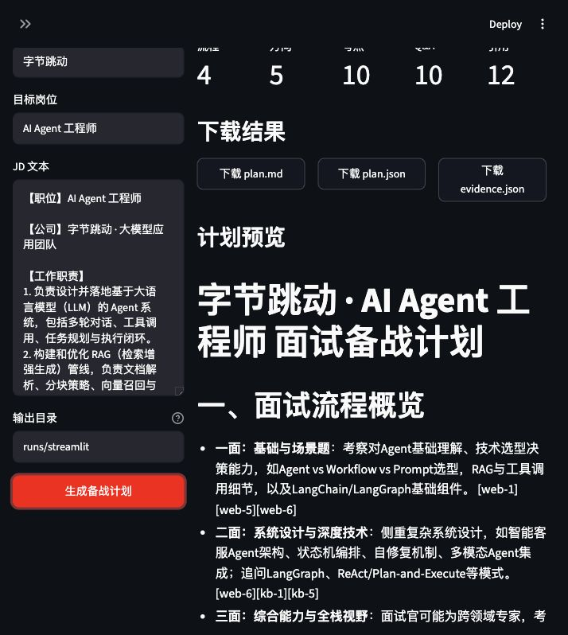
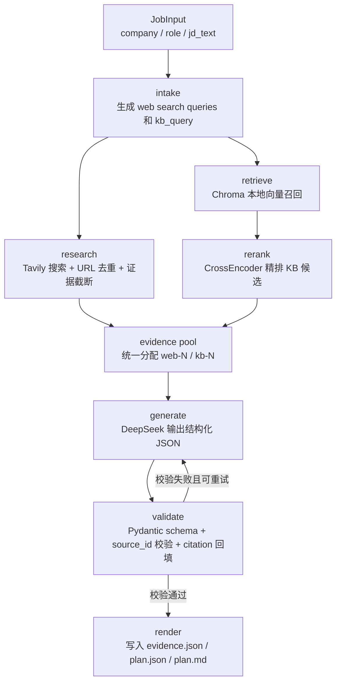
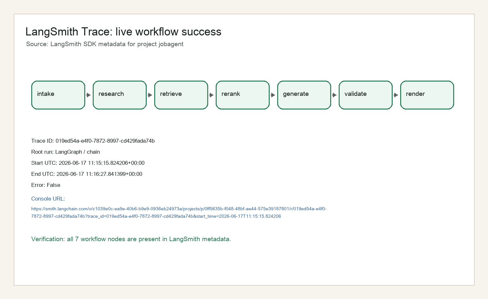
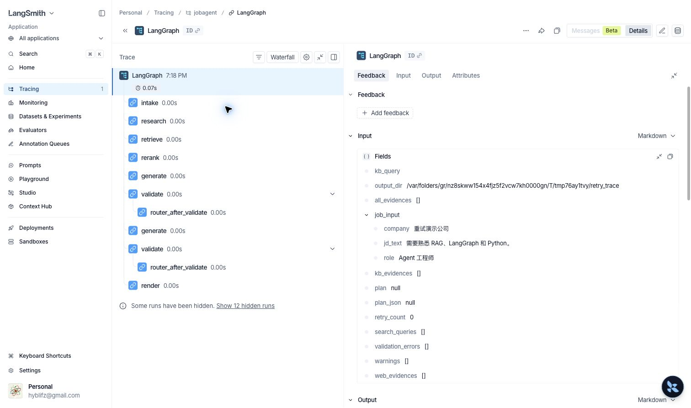
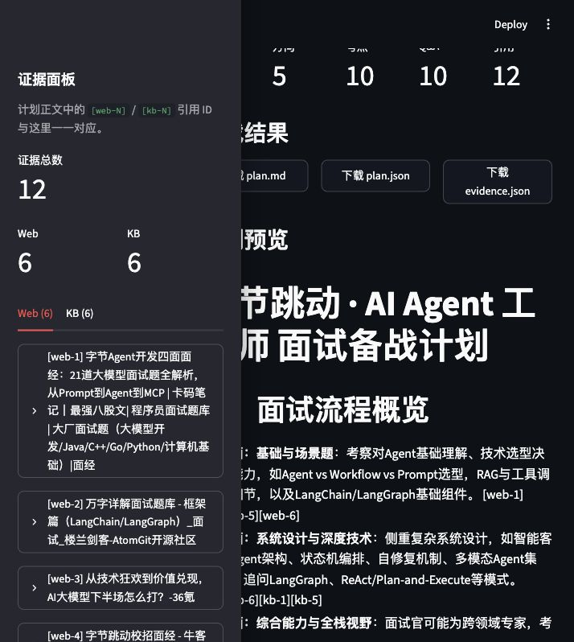

# jobagent

`jobagent` 是一个本地优先的 AI 面试备战 Agent：输入目标公司、岗位和 JD，它会联网调研岗位信息，检索本地八股/面经知识库，并生成一份带来源引用的结构化面试准备计划。



## 解决什么问题

求职准备常见的问题不是“没有资料”，而是资料分散、真假难辨、和目标 JD 的关系不清楚。`jobagent` 把公司/岗位调研、本地知识库检索、reranker 精排、LLM 结构化生成串成一条可复现链路，最后输出面试流程、高频考点、八股问答、行动计划和引用来源。它的目标是做一个能本地演示、能讲清楚工程取舍、能放进简历的 MVP，而不是一开始就做成生产级 SaaS。

## 架构

CLI 和 Streamlit UI 都只负责收集输入、展示进度和结果；核心逻辑统一走 LangGraph workflow。



这条链路里最值得讲的两个点：

- `validate -> generate` 是真实的自修复环：当 JSON schema、引用 ID 或完整性校验失败时，把错误回灌给 LLM 重新生成。
- 检索质量门控放在 `retrieve -> rerank`：Chroma 先召回较宽的候选集合，CrossEncoder 再按 query 与片段的语义相关性重排，最终只把高质量 KB evidence 交给生成节点。

## 技术选型

| 模块 | 选型 | 为什么是它 |
| --- | --- | --- |
| 语言 / 依赖 | Python 3.11 + uv | Python 生态适合快速连接 LLM、RAG、评测和 Streamlit；uv 让依赖锁定和本地复现更稳定。 |
| UI | Streamlit | 本地 demo 成本低，能快速展示输入、节点进度、warning、证据面板和下载结果。 |
| Agent 编排 | LangGraph | 这个项目需要 `validate -> generate` 的有状态 cycle，用 LangGraph 比线性脚本更能表达重试、自修复和节点级可观测。 |
| 搜索 | Tavily | MVP 只需要稳定的摘要式 web evidence，避免自己抓取网页正文和处理反爬。 |
| 向量库 | Chroma 直连 | 本地持久化、零运维；当前链路足够薄，不引入 LlamaIndex，减少抽象层和调试面。 |
| Embedding | `BAAI/bge-small-zh-v1.5` | 轻量中文向量模型，适合本地样例语料和面试题检索。 |
| Reranker | `BAAI/bge-reranker-v2-m3` via `CrossEncoder` | 20 题 eval 中，rerank 将 hit@3 从 0.900 提升到 0.950，MRR 从 0.842 提升到 0.925。 |
| LLM | DeepSeek OpenAI-compatible API | 成本和中文能力适合本地作品 demo；通过 OpenAI-compatible client 保持替换空间。 |
| 校验 | Pydantic + 自定义引用校验 | 让 LLM 输出先变成可验证结构，再渲染成 Markdown/UI，避免“看起来对但引用断掉”。 |
| 可观测 | LangSmith | 在开启 tracing 时记录每个 LangGraph node 的输入输出、耗时和重试路径，方便面试中展示工程链路。 |

## 评测

固定 eval 集在 `src/eval/eval_set.json`，共 20 个问题，覆盖 RAG、Agent、数据库、网络、并发、系统设计、机器学习指标、Linux 排障等主题。其中 8 个 `hard_*` case 刻意使用换述和相似 heading 干扰，用来观察 reranker 相对纯向量召回的边际收益。

2026-06-17 基线：`top_k=5`，`n_candidates=20`，不加 BGE 查询前缀。

| mode | hit@3 | hit@5 | MRR |
| --- | ---: | ---: | ---: |
| no_rerank | 0.900 | 0.900 | 0.842 |
| rerank | 0.950 | 0.950 | 0.925 |

参数扫描结论：

| n_candidates | top_k | query prefix | rerank hit@3 | rerank hit@5 | rerank MRR |
| ---: | ---: | --- | ---: | ---: | ---: |
| 10 | 3 | no | 0.950 | 0.950 | 0.925 |
| 20 | 5 | no | 0.950 | 0.950 | 0.925 |
| 30 | 5 | no | 0.950 | 0.950 | 0.917 |
| 20 | 5 | yes | 0.950 | 0.950 | 0.917 |

分析：12 道基础题在纯向量召回下已经全部 top-1 命中，所以 reranker 的价值主要体现在 hard case。代表例是 `hard_rag_retrieval_pipeline`：no-rerank 未进入 top-5，rerank 后命中 rank 2，说明 CrossEncoder 对换述后的 RAG 流程问题有实际帮助。

当前默认保留 `n_candidates=20`、`top_k=5`、不加查询前缀。`n_candidates=30` 没有带来稳定收益，查询前缀也没有提升 MRR；`hard_coroutine_io_efficiency` 在两种模式下仍未命中，后续要通过语料覆盖和 hard case 标注继续打磨。

运行评测：

```bash
uv run python scripts/build_index.py --data-dir data/baguwen --persist-dir .chroma/jobagent
uv run python -m src.eval.retrieval_eval
uv run python -m src.eval.retrieval_eval --scan --out runs/eval/2026-06-17-scan.json
```

## 可观测性

开启 `LANGSMITH_TRACING=true` 后，LangGraph workflow 会把节点输入输出、耗时和重试路径记录到 LangSmith 项目 `jobagent`。06-16 的 live smoke 已验证真实 Tavily + DeepSeek 端到端链路，成功 trace 包含 7 个节点；重试 trace 能看到 `generate -> validate -> generate -> validate` 的自修复路径。





## Quickstart

### 1. 准备环境

```bash
git clone https://github.com/hyblif/jobagent.git
cd jobagent
uv sync
cp .env.example .env
```

编辑 `.env`，至少填写：

```bash
DEEPSEEK_API_KEY=你的 DeepSeek API key
```

可选但推荐：

```bash
TAVILY_API_KEY=你的 Tavily API key
LANGSMITH_TRACING=false
LANGSMITH_API_KEY=
LANGSMITH_PROJECT=jobagent
```

说明：

- `DEEPSEEK_API_KEY` 用于生成备战计划，是完整 demo 的必需配置。
- `TAVILY_API_KEY` 缺失时，联网调研会产生 warning；workflow 仍会尽量基于本地 KB 继续。
- `EMBEDDING_MODEL_PATH` / `RERANKER_MODEL_PATH` 可指向本地模型目录；未设置时使用 `.env.example` 中的默认 Hugging Face 模型名。

### 2. 构建本地知识库

```bash
uv run python scripts/build_index.py --data-dir data/baguwen --persist-dir .chroma/jobagent
```

当前公开样例语料会索引为 162 个 chunk。Chroma 可能打印类似 `capture() takes 1 positional argument but 3 were given` 的 telemetry warning；已验证索引构建和查询不受影响。

### 3. 运行 CLI

```bash
uv run python -m src.cli plan \
  --company "阿里巴巴" \
  --role "Agent 工程师" \
  --jd-file examples/jd_agent_engineer.txt \
  --out runs/demo
```

也可以使用脚本入口：

```bash
uv run jobagent plan \
  --company "阿里巴巴" \
  --role "Agent 工程师" \
  --jd-file examples/jd_agent_engineer.txt \
  --out runs/demo
```

运行后会生成：

```text
runs/demo/
├── evidence.json
├── plan.json
└── plan.md
```

### 4. 运行 Streamlit UI

```bash
uv run streamlit run app.py
```

UI 会展示 LangGraph 节点进度、结果摘要、证据面板、warning/validation error，以及 `plan.md` / `plan.json` / `evidence.json` 下载按钮。



### 5. 运行测试

```bash
uv run pytest
```

当前验证基线：

- `uv run pytest`：42 passed，1 skipped live test。
- `RUN_LIVE_TESTS=1 uv run pytest tests/test_live_smoke.py -v`：真实 Tavily + DeepSeek live smoke 通过。
- `uv run python -m src.eval.retrieval_eval`：20 cases，rerank hit@3 0.950 / hit@5 0.950 / MRR 0.925。

## 主要目录

```text
jobagent/
├── app.py                         # Streamlit UI
├── examples/                      # 示例 JD
├── scripts/build_index.py          # 构建 Chroma 索引
├── src/
│   ├── cli.py                     # CLI 入口
│   ├── agent/                     # LangGraph workflow 和节点
│   ├── rag/                       # ingest / retriever / rerank / store
│   ├── tools/                     # Tavily web search
│   ├── schemas/                   # JobInput / Evidence / PrepPlan
│   └── eval/                      # retrieval eval
├── data/baguwen/                  # 自写样例语料
├── docs/img/                      # README / demo 截图
├── tests/                         # 单元测试与 live smoke
└── plans/                         # 每日开发计划与完成记录
```

## MVP 边界

当前会做：

- 输入公司、岗位和 JD 文本。
- Tavily 联网调研岗位/公司/面试信息。
- 本地 Chroma + BGE embedding + reranker 检索公开样例知识库。
- DeepSeek 生成带引用的结构化备战计划。
- CLI / Streamlit 两个本地入口。
- 保存 `evidence.json`、`plan.json`、`plan.md` 方便复现。
- LangSmith trace 和 live smoke 用于展示真实链路。

当前不做：

- 不做登录、多用户、权限、数据库后台和云端部署。
- 不做简历解析、自动投递或账号自动化。
- 不抓取付费面经原文，不在仓库公开保存第三方受限内容。
- 不做模型微调。

## Future Work

- 模拟面试闭环：根据备战计划生成问题、收集回答、评分并给出反馈。
- demo 录制：把 Streamlit 运行、证据面板、LangSmith trace 串成 2-3 分钟视频。
- 检索评测扩展：增加更多 hard case，继续定位 `hard_coroutine_io_efficiency` 这类 miss。
- README / 简历材料联动：把架构取舍、指标和截图沉淀成面试讲述稿。

## 语料声明

仓库内 `data/baguwen/` 是少量自写样例语料，仅用于个人学习、本地知识库构建和项目演示。请不要把第三方付费、受限或未获授权的面经原文提交到公开仓库。

个人扩展语料可以放到：

```text
data/baguwen/private/
```

该目录已加入 `.gitignore`。
